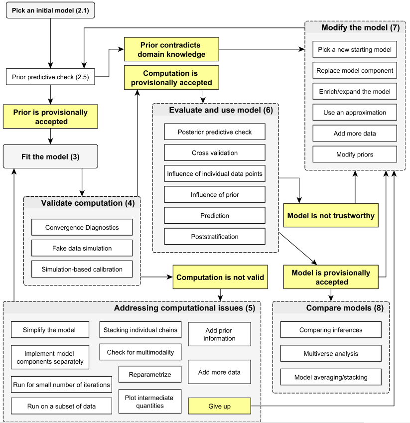

```{r, echo=FALSE}
## --- Options ---
eval_ex <- TRUE
eval_sol <- TRUE
eval_learnr <- TRUE

knitr::opts_chunk$set(message = FALSE,
                      warning = FALSE)

## --- learnr ---
if ("learnr" %in% (.packages()))
  detach(package:learnr, unload = TRUE)
library(learnr)
```

```{r, echo=FALSE, context="server"}
## --- Options ---
eval_ex <- TRUE
eval_sol <- TRUE
eval_learnr <- TRUE
```

```{r setup, include=FALSE}
## ---- CRAN Packages ----
## Save package names as a vector of strings
pkgs <-  c("rstan", "rstantools", "coda", "dplyr")

## Install uninstalled packages
lapply(pkgs[!(pkgs %in% installed.packages())], 
       install.packages,
       repos='http://cran.us.r-project.org')

## Load all packages to library and adjust options
lapply(pkgs, library, character.only = TRUE)

## ---- GitHub Packages ----


## ---- Global learnr Objects ----

## ---- export function ----
export <- function(env = environment()) {
  invisible({
    global_obj <- eval(global_objects, envir = globalenv())
    local_obj <- ls(envir = env)
    new_obj <- local_obj[!(local_obj %in% global_obj)]
    sapply(new_obj, function(x) {
      assign(x, get(eval(x, envir = env), envir = env), envir = globalenv())
    })
  })
  if (!is.null(new_obj)){
    print("Exported objects:")
    print(new_obj)
  }
}
global_objects <- c(ls(), "global_objects")

## ---- rstan Options ----
rstan_options(auto_write = TRUE)             # avoid recompilation of models
options(mc.cores = parallel::detectCores())  # parallelize across all CPUs
```

## Reasons for going Bayesian

Practitioners choose to go Bayesian for a multitude of reasons. Any one
of the following or any combination of the following may apply (partly
based on Jackman 2009):

### Paradigmatic reasons: Bayesian inference answers the question one really asks

Frequentist $p$-values tell you how likely it would be to find another
result as 'strong' or 'extreme' as the current result if the analysis at
hand would be repeated many times over.

It is therefore a statement about the plausibility of the *data given a
null hypothesis*.

What we usually really want to make are statements about the
plausibility of a *hypothesis given the data*.

### Paradigmatic reasons: Bayesian inference is accessible and intuitive

Bayesian inference allows researchers to directly and intuitively
communicate results.

What researchers often really want to say is what is the probability of
an event, classification, or hypothesis in light of the data currently
at hand, e.g.:

-   What is the probability that the treatment effect of an experiment
    is positive, negative, or greater than some threshold (e.g., given
    data from clinical pre-trials, what is the probability that a new
    vaccine reduces infections by at least 10%)?
-   What is the probability that a specific hypothesis is true?
-   What is the probability that an individual belongs to a certain
    latent class?

### Paradigmatic reasons: Inference beyond NHST

Frequentist inference often goes hand in hand with null-hypothesis
significance testing (NHST), which involves binary statements about
statistical significance based on $p$-value thresholds.

This focus on binary significance has been widely criticized (e.g.,
[Gill 1999](https://www.jstor.org/stable/449153); [McShane et al.,
2019](https://www.tandfonline.com/doi/full/10.1080/00031305.2018.1527253)).

Bayesian inference via posterior distributions lends itself to
communicating support for specific hypothesis via gradual measures.

### Logical reasons

Frequentist inference is based on data that can be repeatedly (and,
theoretically, infinitely often) sampled from an underlying population.
At face value, this requires a quasi-infinite stream of independently
and identically distributed data.

Given time and resources, this is plausible for some applications --
coin flips, physical or chemical experiments, or survey-based research
-- but not for others (e.g., a time-series analysis of annual imports
and economic productivity in the GDR).

Bayesian inference provides a principled framework for analyzing
non-repeatable data.

### Substantive reasons: Incorporating prior beliefs

The necessity to specify prior beliefs is sometimes considered a
nuisance and/or weak point of Bayesian inference:

-   In absence of prior beliefs, researchers typically specify
    uninformative and vague priors.
-   The inclusion of informative prior beliefs is often criticized as
    bringing "subjectivity" into the data analysis.

Yet researchers can often incorporate informative prior beliefs
productively.

Suppose you are on to a major contribution, based on a finding that runs
counter to conventional wisdom:

-   You can accurately characterize prior knowledge based on a meta
    analysis of existing research.
-   You can then show that your analysis produces a deviating, novel
    result *despite* the incorporation of contrary prior knowledge.

### Pragmatic reasons: Stable and reliable estimates

Complex statistical models often fail to converge when using
likelihood-based estimators or are not at all implementable in existing
estimation frameworks.

Bayesian inference via numerical Markov Chain Monte Carlo methods
provide a powerful, versatile, and stable toolbox to overcome these
limitations.

### Pragmatic reasons: Regularizing priors

Some important questions cannot be addressed with conventional
techniques due to overfitting.

Bayesian data analysis allows researchers to specify regularizing priors
that help prevent this problem.

### Pragmatic reasons: Non-normal posterior distributions

Frequentist inference often assumes asymptotic normality of estimators
(i.e., that sampling distributions can be approximated by a normal
distribution in very large samples).

But samples aren't always that large and not all parameters plausibly
follow a normal distribution.

Bayesian inference gives a way out:

-   Quantile summaries of posterior distributions instead of analytical,
    symmetrical confidence intervals
-   Direct specification of non-normal and/or constrained parameters


### Trade-offs: Priors

-   Choice of priors allows us to explicitly incorporate prior beliefs
    about parameters...
-   ...but also comes with the obligation to be transparent and
    responsible with respect to the subjectivity this brings into our
    analyses

### Trade-offs: Finite-sample and asymptotic properties

-   Bayesian inference allows for exact inference in finite-sample
    applications where the asymptotic properties of MLE estimators are
    implausible (normal approximation, etc.)...
-   ...yet, posterior distribution often asymptotically converge to the
    sampling distribution of MLE estimators ([Bernstein-von-Mises
    Theorem](https://en.wikipedia.org/wiki/Bernstein%E2%80%93von_Mises_theorem))

### Trade-offs: Flexibility and computational reliability

-   The use of MCMC algorithms for probabilistic approximate inference
    makes Bayesian approaches incredibly flexible and allows for
    computationally reliable estimation of complex, analytically
    intractable marginal likelihoods (avoids integration of super
    high-dimensional integrals)...
-   ...but sometimes comes with the necessity of high computational
    resources and/or long computation times, and *always* necessitates
    careful convergence diagnosis


## Applied Bayesian data analysis: A short history 

### Classical Bayes in the 20th century

<blockquote>
<sub>An important hallmark of the classical era of Bayesian statistics was the relative ease with which a joint posterior distribution that could not be integrated into the constituent marginal distributions could be produced with actual social science data and a realistic model based on theoretical principles.</sub> <br>

<sub>It was easy in the middle of the 20th century to produce a model such as this whereby it was prohibitively difficult or impossible to integrate-out each parameter for a series of marginal posterior distributions to describe inferentially. This led Evans (1994) to retrospectively describe Bayesians of the time as 'unmarried marriage guidance councilors' because they could tell others how to do inference when they often could not do it themselves.</sub>
</blockquote>

::: {style="text-align: right"}
<sub><sup>
[Gill, J., & Heuberger, S. (2020). Bayesian Modeling and Inference: A Postmodern Perspective. In L. Curini & R. Franzese (Eds.), The SAGE Handbook of Research Methods in Political Science and International Relations (pp. 961–984).](https://jeffgill.org/wp-content/uploads/2021/04/curini_franzese_v2_chp50_1pp_01.pdf)
</sub></sup>
:::

### The revolution: Computational numerical Bayes via MCMC

<blockquote>
<sub>This world, and *the* world, changed in 1990 with a review essay by Gelfand and Smith in the *Journal of the American Statistical Association*. In what is without a doubt one of the ten most important articles published in statistics, they found that a tool, Gibbs sampling, hiding in engineering and image restoration (Geman and Geman, 1984), solved this very problem for the Bayesians. Gibbs sampling replaced analytical derivation of marginals from a joint distribution with work from the computer.</sub> <br>

<sub>The general name for the new tool is Markov chain Monte Carlo (MCMC), which includes Gibbs sampling [...]. The principle behind MCMC is that a Markov chain can be setup to describe a high dimension posterior distribution by wandering around the state space visiting subregions in proportion to the density that needs to be summarized.</sub> <br>

<sub>The linkage between ‘MC’ and ‘MC’ is the ergodic theorem that says that if the Markov chain is created according to some specific technical criteria and is run long enough such that it converges to its stationary (limiting) distribution, the draws from the path of the chain can be treated as if they are IID from the respective marginal distributions.</sub> <br>

<sub>To say that MCMC revolutionized Bayesian inference and general Bayesian work is to say that commercial air flights slightly improved global travel. It was in fact the tool that freed the Bayesians; no longer were models too complex for the marginalization of joint posteriors to create regression tables and other intuitive summaries.</sub>
</blockquote>

::: {style="text-align: right"}
<sub><sup> 
[Gill, J., & Heuberger, S. (2020). Bayesian Modeling and Inference: A Postmodern Perspective. In L. Curini & R. Franzese (Eds.), The SAGE Handbook of Research Methods in Political Science and International Relations (pp. 961–984).](https://jeffgill.org/wp-content/uploads/2021/04/curini_franzese_v2_chp50_1pp_01.pdf)
</sub></sup>
:::


### Major programming languages and softwares

The development and consolidation of free (and, later, free and open) software marked critical for the advancement of MCMC-based Bayesian data analysis. The most prominent such endeavors include:

1. [BUGS](https://www.mrc-bsu.cam.ac.uk/software/bugs/) (**B**ayesian Inference **U**sing **G**ibbs **S**ampling), a project started in the MRC Biostatistics Unit in Cambridge in 1989
    1. [WinBUGS](https://www.mrc-bsu.cam.ac.uk/software/bugs/the-bugs-project-winbugs/), developed until 2007
    1. [OpenBUGS](https://www.mrc-bsu.cam.ac.uk/software/bugs/openbugs/), 2005-2014
    1. [MultiBUGS](https://www.multibugs.org/), a parallelizable version of OpenBUGS, last updated 2020
1. [JAGS](https://mcmc-jags.sourceforge.io/) (**J**ust **A**nother **G**ibbs **S**ampler)
    - A cousin of the BUGS langauge, written by [Martyn Plummer](https://warwick.ac.uk/fac/sci/statistics/staff/academic-research/plummer/) with the aim of providing a extensible cross-platform toolbox for Bayesian modeling
    - Since 2007, latest release 2022
1. [Stan](https://mc-stan.org/), a C++ based language and platform for statistical computation using Hamiltonian Monte Carlo algorithms
    - Cross-platform software that interfaces with many major statistical softwares, incl. R, Python, shell, MATLAB, Julia, and Stata
    - Initiated by the [Stan Development Team](https://mc-stan.org/about/team/) (Gelman et al.) in 2012, ongoing
    - Emphasis on fast and stable computation using state-of-the-art algorithms


### Applied Bayesian data analysis until the mid-2010s

Despite significant advancements in MCMC-based Bayesian data analysis since the early 1990s, it arguably remained a niche methodology until the mid-2010s, albeit with an increasingly broadening niche.

Why? Because many steps in the data analytical workflow remained disproportionately cumbersome and idiosyncratic:

1. No toolbox for pre-processing
    - Software-specific manual pre-processing of data
    - Software-specific manual implementation of model code (though textbooks and open science advocates contributed to an ever-growing collection of curated model codes)
    - Software-specific manual initialization of MCMC algorithms
1. Bayesian inference
    - Need to specify priors
    - Inference in specific software (though many softwares interfaced with R early on)
    - Computationally demanding and, therefore, time-consuming 
1. Need for convergence diagnosis
1. No toolbox for post-processing
    - Need to manually craft regression tables
    - Need to manually calculate substantive quantities of interest (e.g., expected values, average marginal effects)
    - Need to manually visualize quantities of interest

### Example I: A linear model in BUGS/JAGS

```{r, eval = FALSE, echo = TRUE}
# ---- Data ----
# Load data
data <- read.dta("some_data.dta", convert.factors = F)

# Define data for JAGS
N <- nrow(data)
y <- data$y
X <- model.matrix( ~ x2 + x3 + x4, data = data)
K <- ncol(X)

# Store all data we need for the model in a list
jags_data <- list(y = y,
                  X = X,
                  K = K,
                  N = N)

# ---- Linear Model ----
# Define the model
model0 <- function() {
  # Likelihood
  for (i in 1:N) {
    y[i] ~ dnorm(y.hat[i], tau)
    y.hat[i] <- inprod(b[], X[i, ])
    # equivalent: b1[i] + b2*x2[i] + b3*x3[i] + b4*x4[i]
  }
  
  # Priors
  tau <- pow(sigma,-2) # precision - inverse of variance
  sigma ~ dunif(0, 100)
  for (k in 1:K) {
    b[k] ~ dnorm(0, .0001)
  }
}

# Save the model
write.model(model0, "model0.bug")

# ---- Initial values (initial values as list of lists) ----
inits <- list(
  list(
    b = rnorm(K),
    sigma = runif(1),
    .RNG.seed = 123,
    .RNG.name = "base::Mersenne-Twister"
  ),
  list(
    b = rnorm(K),
    sigma = runif(1),
    .RNG.seed = 456,
    .RNG.name = "base::Mersenne-Twister"
  )
)

# ---- Pass model to JAGS and perform inference ----
m_0 <- jags.model(
  file = "model0.bug",
  data = jags_data,
  n.chains = 2,
  inits = inits,
  n.adapt = 2000
)

# Burn in
update(m_0, n.iter = 15000) # 1st-15,000th iterations will be discarded

# Run Sampler
m_0_out <- coda.samples(
  model = m_0,
  variable.names = c("b", "sigma"),
  n.iter = 5000
)
```

### Convenience functionalities for R users

#### Convenience functionalities

- Printing of posterior summaries (regression tables) in the R console via `summary()`
- Visual posterior summaries (histograms, densities, posterior medians with credible intervals) via `plot()`
- Generic and visual diagnostics via the `coda` package

#### Outputs users had to craft manually

- Formatted regression tables for Word/LaTeX/Markdown
    - Usually, a combination of posterior summaries + one of the `xtable`/`huxtable`/`kable`
    - More recently, also convenience wrappers like `BayesPostEst`
- Substantive quantities of interest (incl., but not limited to, expected values, linear predictions, first differences, average marginal effects)
- Visualizations of substantive quantities of interest

### Example: A linear model in Stan

#### Data pre-processing (R) -- same as for BUGS/JAGS

```{r, eval = FALSE, echo = TRUE}
# ---- Data ----
# Load data
data <- read.dta("some_data.dta", convert.factors = F)

# Define data for Stan
N <- nrow(data)
y <- data$y
X <- model.matrix( ~ x2 + x3 + x4, data = data)
K <- ncol(X)

# Store all data we need for the model in a list
stan_data <- list(y = y,
                  X = X,
                  K = K,
                  N = N)
```

#### Model code (Stan)

```{stan, eval = FALSE, echo = TRUE, output.var = "lm.stan"}
data {
  int<lower=0> N;   // number of observations
  int<lower=0> K;   // number of predictors (incl. intercept)
  matrix[N, K] x;   // predictor matrix
  vector[N] y;      // outcome vector
}

parameters {
  vector[K] beta;       // coefficients for intercept and predictors
  real<lower=0> sigma;  // error scale
}

model {
 // priors
  beta ~ normal(0, 10);  // priors for beta
  sigma ~ cauchy(0, 5);  // prior for sigma

  // likelihood
  y ~ normal(x * beta + alpha, sigma);
}
```

#### Compilation, inference, and summarize (R -> C++ -> R)

```{r, eval = FALSE, echo = TRUE}
# Compile the model in C++
stan_lm <- stan_model(file = "lm.stan")

# Fit the model
est <- sampling(stan_lm,                           ### compiled model
                data = stan_data,                  ### data input
                algorithm = "NUTS",                ### algorithm
                pars = c("beta", "sigma"),         ### select parameters
                iter = 2000L,                      ### iter per chain
                warmup = 1000L,                    ### warmup period
                chains = 4L,                       ### num. chains
                cores = 4L,                        ### num. cores
                seed = 20190417)                   ### seed

# Summarize
est
```

### Convenience functionalities for R users

#### Convenience functionalities

- Printing of posterior summaries (regression tables) and generic diagnostics in the R console via `print()`
- Static and interactive visual posterior summaries via the `rstan`, `bayesplot` and `shinystan` packages
- Static and interactive implementations of generic, algorithm-specific, and visual diagnostics via the `rstan`, `bayesplot` and `shinystan` packages

#### Outputs users had to craft manually

- Formatted regression tables for Word/LaTeX/Markdown
    - Usually, a combination of posterior summaries + one of the `xtable`/`huxtable`/`kable`
    - More recently, also convenience wrappers like `BayesPostEst` and `modelsummary`
- Substantive quantities of interest (incl., but not limited to, expected values, linear predictions, first differences, average marginal effects)
- Visualizations of substantive quantities of interest


### Applied Bayesian data analysis since the mid-2010s

Over the last decade, applied Bayesian modeling has evolved from a niche methodology with high computational and software-specific entry barriers to a readily available toolbox that virtually everyone can use by running pre-implemented packages in standard statistical software on generic PCs.

What happened? In my view:

1. Stan *really* took off: Its modern approach to software presentation and software development attracted users and developers alike.
1. The speed of Stan's algorithm, coupled with increasing RAM and CPU performances of home computers and the increasing availability of remote computing services, made computational demands a much smaller obstacle.
1. The Stan Development Team and dedicated members of the Stan Community (some of whom later joined the Development Team) put significant efforts into developing flexible, versatile, reliable, and easy-to-use software interfacing Stan that allow **R** users to run Bayesian analyses:
    - without software-specific manual pre-processing of data
    - without software-specific manual implementation of model code
    - without software-specific manual initialization of MCMC algorithms
    - without needing to make informed choices about priors due to defaults (*note:* not everybody is thrilled about that.)
    - with access to a large number of model types
    - with accessible, intuitive, and interactive tools for convergence diagnosis
    - with convenience functions for post-processing
1. In light of the increasing popularity of Stan, developers of general statistical convenience software for **R** extended the compatibility of their software to convenience software interfacing **Stan** (e.g., `emmeans`, `marginaleffects`, `brmsmargins`)

## Stan

### Why Stan?

- Open-source software
- Fast and stable algorithms
- High flexibility with few limitations
- Extensive documentation
    - [User's Guide](https://mc-stan.org/docs/2_19/stan-users-guide/index.html)
    - [Language Reference Manual](https://mc-stan.org/docs/2_19/reference-manual/index.html)
    - [Language Functions Reference](https://mc-stan.org/docs/2_19/functions-reference/index.html)
- Highly transparent development process; see [Stan Development Repository on Github](https://github.com/stan-dev/stan)
- Very responsive [Development Team](https://mc-stan.org/about/team/)
- Large and active community in the [Stan Forums](https://discourse.mc-stan.org/) and [Stack OVerflow](https://stackoverflow.com/questions/tagged/stan)
- Increasing number of [case studies](https://mc-stan.org/users/documentation/case-studies.html) on specific classes of statistical models and specific aspects of using Stan, [tutorials](https://mc-stan.org/users/documentation/tutorials.html) about Stan and HMC, specialized field guides for using Stan for [education research](https://education-stan.github.io/), [ecology](https://stanecology.github.io/), [epidemiology](https://epidemiology-stan.github.io/), and [cognitive science](https://cognitive-science-stan.github.io/), as well as an increasing number [papers and textbooks](https://mc-stan.org/users/documentation/external.html)
- Compatibility with various editor for syntax highlighting, formatting, and checking (incl. [RStudio](https://www.rstudio.com/) and [Emacs](https://www.gnu.org/software/emacs/))

### Stan interfaces

- RStan (R)
- PyStan (Python)
- CmdStan (shell, command-line terminal)
    - CmdStanR
    - CmdStanPy
- MatlabStan (MATLAB)
- Stan.jl (Julia)
- StataStan (Stata)
- MathematicaStan (Mathematica)
- ScalaStan (Scala)

### (Some) R packages

- [**rstan**](https://cran.r-project.org/package=rstan): General R Interface to Stan
- [**brms**](https://cran.r-project.org/package=brms): Bayesian Regression Models using 'Stan', covering a growing number of model types
- [**rstanarm**](https://cran.r-project.org/package=rstanarm): Bayesian Applied Regression Modeling via Stan, with an emphasis on hierarchical/multilevel models
- [**rethinking**](https://www.rdocumentation.org/packages/rethinking/versions/2.13): An R package that accompanies McElreath's course and book *Statistical Rethinking*, featuring functionalities for statistical modeling
- [**edstan**](https://cran.r-project.org/package=edstan): Stan models for item response theory
- [**blavaan**](https://cran.r-project.org/web/packages/blavaan/index.html): Bayesian latent variable analysis and structural equation modeling
- [**shinystan**](https://cran.r-project.org/package=shinystan): Interactive Visual and Numerical Diagnostics and Posterior Analysis for Bayesian Models
- [**bayesplot**](https://cran.r-project.org/web/packages/bayesplot/index.html): Plotting functions for posterior analysis, model checking, and MCMC diagnostics.
- [**shinystan**](https://cran.r-project.org/web/packages/shinystan/index.html): Interactive visual and numerical diagnostics and posterior analysis for Bayesian models
- [**rstantools**](https://cran.r-project.org/package=rstantools): Tools for Developing R Packages Interfacing with 'Stan'
- [**loo**](https://cran.r-project.org/web/packages/loo/index.html): Efficient leave-one-out cross-validation and WAIC for Bayesian models

### The benefit of the Stan package landscape in R

Today, Stan offers both

- a high-end platform for model development and model building for advanced users in search of custom modeling solutions ($\rightarrow$ *Advanced Bayesian Statistical Modeling* -- Stan and `rstan`)
- a versatile and relatively easy-to-use toolbox for applied researchers using **R** who seek to go Bayesian using pre-implemented models and functions ($\rightarrow$ *Introduction to Bayesian Statistics* -- `brms`; also `rstanarm`, `rethinking`)


## A simplified Bayesian workflow

### The very short version

<blockquote>
<sub>*Bayesian workflow* includes the three steps of model building, inference, and model checking/improvement, along with the comparison of different models, not just for the purpose of model choice or model averaging but more importantly to better understand these models.</sub>
</blockquote>

<div style="text-align: right"> 
  <sub><sup>
    Source: [Gelman, A., Vehtari, A., Simpson, D., Margossian, C. C., Carpenter, B., Yao, Y., Kennedy, L., Gabry, J., Bürkner, P. C., & Modrák, M. (2020). Bayesian workflow.](https://arxiv.org/abs/2011.01808)
  </sub></sup>
</div>

### The long version

```{r workflow, echo = FALSE, out.width = '90%', fig.align="center"}

```

<div style="text-align: right"> 
  <sub><sup>
    Source: [Gelman, A., Vehtari, A., Simpson, D., Margossian, C. C., Carpenter, B., Yao, Y., Kennedy, L., Gabry, J., Bürkner, P. C., & Modrák, M. (2020). Bayesian workflow.](https://arxiv.org/abs/2011.01808)
  </sub></sup>
</div>

### A moderately long version

1. **Specification**: Specify the full probability model
    - data
    - likelihood
    - priors
2. **Model Building**: Translate the model into code
3. **Validation**: Validate the model with fake data
4. **Fitting**: Fit the model to actual data
5. **Diagnosis**: Check generic and algorithm-specific diagnostics to assess convergence
6. Posterior Predictive Checks
7. Model Comparison

<div style="text-align: right"> 
  <sub><sup>
    Source: [Jim Savage (2016) A quick-start introduction to Stan for economists. A QuantEcon Notebook.](http://nbviewer.jupyter.org/github/QuantEcon/QuantEcon.notebooks/blob/master/IntroToStan_basics_workflow.ipynb)
  </sub></sup>
</div>

### Foregoing model building simplifies the workflow

Given we do not need to build our own *model code* from scratch, our workflow simplifies quite a bit.

But we will need to build our models in the sense that we set the *model specification*.

Therefore, many steps of the workflow remain in the hand of us as applied researchers. Many of these steps pertain to frequentist and Bayesian analysis alike. How relevant and challenging each of these steps is likely depends on the specific application at hand.

The below is a (likely incomplete) list of steps we may want to take as part of a principled simplified workflow using pre-implemented models:

1. Initial model choice
1. Prior choice and prior predictive checks
1. Convergence diagnosis
1. Modification, expansion, or simplification of the model
1. Algorithmic fine-tuning
1. Posterior predictive checks
1. Cross-validation (out-of-sample-prediction)
1. Model comparison

### Further reading

- [Gelman, A., Vehtari, A., Simpson, D., Margossian, C. C., Carpenter, B., Yao, Y., Kennedy, L., Gabry, J., Bürkner, P. C., & Modrák, M. (2020). *Bayesian workflow.* ArXiv.](https://arxiv.org/abs/2011.01808)
- [Nicenboim, B., Schad, D., & Vasishth, S. (2023). *An Introduction to Bayesian Data Analysis for Cognitive Science.* Ch. 7.](https://vasishth.github.io/bayescogsci/book/ch-workflow.html)
