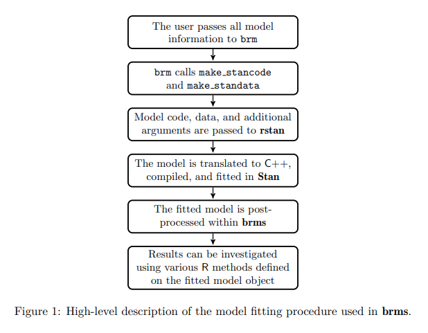

```{r setup, include=FALSE}
knitr::opts_chunk$set(echo = FALSE)

## ---- CRAN Packages ----
## Save package names as a vector of strings
pkgs <-
  c("rstan",
    "brms",
    "future",
    "bayesplot",
    "dplyr")

## Install uninstalled packages
lapply(pkgs[!(pkgs %in% installed.packages())],
       install.packages,
       repos = 'http://cran.us.r-project.org')

## Load all packages to library and adjust options
lapply(pkgs, library, character.only = TRUE)

## ---- Global learnr Objects ----
lab3_url <-
  "https://github.com/denis-cohen/statmodeling/raw/main/data/lab3.RData"
load(url(lab3_url))
```

## Overview

### What is brms?

<blockquote>
<sub>The brms package provides an interface to fit Bayesian generalized (non-)linear multivariate multilevel models using Stan. The formula syntax is very similar to that of the package lme4 to provide a familiar and simple interface for performing regression analyses.</sub>
</blockquote>

::: {style="text-align: right"}
<sub><sup>
[paul-buerkner.github.io/brms](https://paul-buerkner.github.io/brms)
</sub></sup>
:::

It was created and is being maintained by [Paul Bürkner](https://paul-buerkner.github.io/). It is extensively documented on its own [website](https://paul-buerkner.github.io/brms/).

### Comparison: Pre-implemented model types

```{r functionality, exercise = FALSE, echo = FALSE, out.width = '80%', fig.align="center"}
knitr::include_graphics("images/canned.png")
```

<div style="text-align: right">
  <sub><sup>
    Source: [Bürkner, Paul-Christian (2022). brms: An R Package for Bayesian Multilevel Models
using Stan.](https://cloud.r-project.org/web/packages/brms/vignettes/brms_overview.pdf)
  </sub></sup>
</div>

*Note:* This table is from a 2022 publication. Newer versions of `brms` handle [missing values](https://cloud.r-project.org/web/packages/brms/vignettes/brms_missings.html).

### brms vignettes as an indication of its versatility

#### General

- [General Introduction to brms](https://www.jstatsoft.org/article/view/v080i01)

#### Model types

- [Advanced Multilevel Modeling with brms](https://journal.r-project.org/archive/2018/RJ-2018-017/index.html)
- [Bayesian Item Response Modeling with brms](https://arxiv.org/abs/1905.09501)
- [Estimating Distributional Models with brms](https://paul-buerkner.github.io/brms/articles/brms_distreg.html)
- [Estimating Multivariate Models with brms](https://paul-buerkner.github.io/brms/articles/brms_multivariate.html)
- [Estimating Non-Linear Models with brms](https://paul-buerkner.github.io/brms/articles/brms_nonlinear.html)
- [Estimating Phylogenetic Multilevel Models with brms](https://paul-buerkner.github.io/brms/articles/brms_phylogenetics.html)

#### Auxiliary

- [Define Custom Response Distributions with brms](https://paul-buerkner.github.io/brms/articles/brms_customfamilies.html)
- [Parameterization of Response Distributions in brms](https://paul-buerkner.github.io/brms/articles/brms_families.html)
- [Handle Missing Values with brms](https://paul-buerkner.github.io/brms/articles/brms_missings.html)
- [Estimating Monotonic Effects with brms](https://paul-buerkner.github.io/brms/articles/brms_monotonic.html)
- [Running brms models with within-chain parallelization](https://paul-buerkner.github.io/brms/articles/brms_threading.html)

### A function call to brms

```{r, eval=FALSE, echo = TRUE}
lm_brms <- brms::brm(
  sup_afd ~                              # outcome
    la_self,                             # predictor
  data = gles,                           # data
  family = gaussian(link = "identity"),  # family and link
  chains = 4L,                           # number of chains
  iter = 2000L,                          # number of iterations per chain
  warmup = 1000L,                        # number of warm-up samples per chain
  algorithm = "sampling",                # algorithm (HMC/NUTS)
  backend = "rstan",                     # backend (rstan)
  seed = 20231123L                       # seed
)
```

### What happens under the hood

```{r under-hood, echo = FALSE, out.width = '75%', fig.align="center"}

```

<div style="text-align: right"> 
  <sub><sup>
    Source: [Bürkner, Paul-Christian (2022). brms: An R Package for Bayesian Multilevel Models
using Stan.](https://cloud.r-project.org/web/packages/brms/vignettes/brms_overview.pdf)
  </sub></sup>
</div>

## Linear model

### Likelihood

The linear model stipulates that the observed outcomes $y_i$ for every unit $i$ can be expressed as realizations from a normal distribution with unit-specific *mean or location parameter* $\mu_i$ and a constant (i.e., general) *variance or scale parameter* $\sigma^2$.

$$y_i \sim \text{N}(\mu_i, \sigma^2) \text{ for all }i = 1,...N$$

or, alternatively,

$$y_i = \mu_i + \epsilon_i  \text{ for all }i = 1,...N \\ \epsilon_i \sim \text{N}(0, \sigma^2)$$

The latter notation makes explicit that each observed $y_i$ can be thought of as a combination of a *systematic component*, $\mu_i$, and a *stochastic error component*, $\epsilon_i$, which follows a zero-mean normal distribution with constant variance $\sigma^2$.

### The systematic component

The systematic component is represented by the mean parameter $\mu_i$. In fact, $\mu_i$ is merely a *transformed parameter*: It is a linear function of unit-specific data $\mathbf{x}_i$ and coefficients $\beta$.

The formula below illustrates this, using the row vector notation $\mathbf{x}_i^{\prime} \beta$ as shorthand for the scalar notation $\beta_1 + \beta_2 x_{i, 2} + ...+\beta_k x_{i,k}$.

$$\mu_i = \underbrace{\mathbf{x}_i^{\prime} \beta}_{= \beta_1 + \beta_2 x_{i, 2} + ...+\beta_k x_{i,k}}  \text{ for all }i = 1,...N$$

### Parameters and priors

In the linear model, all coefficients $\beta$ as well as the variance $\sigma^2$ are model parameters.

In Bayesian analysis, we must assign them priors (though `brms`, like Stan, will assign default uniform priors if we do not explicitly specify priors).

### Data

We model respondents' support for the AfD (`sup_afd`, measured on an 11-point scale ranging from -5 to 5) as a function of respondents' pro-redistribution preferences (`se_self`) and anti-immigration preferences (`la_self`), a multiplicative interaction term between the two, and some controls: Gender (`fem`), age (`age`), and East/West residence (`east`).

Both `se_self` and `la_self` are measured on 11-point scales:

-   `se_self` ranges from values (0) "less taxes and deductions, even if that means less social spending" to (10) "more social spending, even if that means more taxes and deductions".
-   `la_self` ranges from values (0) "facilitate immigration" to (10) "restrict immigration".

The model formula is given by

$$
\mathtt{sup\_afd}_i = \\\beta_1 + \beta_2 \mathtt{se\_self}_i + \beta_3 \mathtt{la\_self}_i + \\ \beta_4 \mathtt{fem}_i + \beta_5 \mathtt{east}_i + \beta_6 \mathtt{age}_i + \\ \beta_7 \mathtt{se\_self}_i \times \mathtt{la\_self}_i + \epsilon
$$

## Fitting

### Choosing priors

`brms` uses default priors for certain "classes" of parameters. To check these defaults,
we need to supply the model formula, data, and generative model (i.e., family and link function) to
`brms::get_prior()`.

```{r brms-model-1, echo = TRUE, eval = FALSE}
# Get default priors
default_priors <- brms::get_prior(
  sup_afd ~                              # outcome
    la_self *                            # immigration preferences
    se_self +                            # redistribution preferences
    fem +                                # gender
    east +                               # east/west residence
    age,                                 # age
  data = gles,                           # data
  family = gaussian(link = "identity")   # family and link
)
default_priors
```

*Note:* Missing entries in the `prior` column denote flat/uniform priors.

### Define custom priors

If we don't like the default priors, we can create a `brmsprior` object
by specifying the desired distributional properties of parameters of
various classes:

```{r brms-model-2, echo = TRUE, eval = FALSE}
custom_priors <- c(
  brms::prior(normal(0, 5), class = b),          # normal slopes
  brms::prior(normal(0, 5), class = Intercept),  # normal intercept
  brms::prior(cauchy(0, 5), class = sigma)       # half-cauchy SD
)
custom_priors
```

### Fitting the model

Lastly, we can fit the model using `brms::brm()`. 

*Note:* Model compilation and estimation may take a while.

```{r brms-model-3, echo = TRUE, eval = FALSE}
lm_brms <- brms::brm(
  sup_afd ~                              # outcome
    la_self *                            # immigration preferences
    se_self +                            # redistribution preferences
    fem +                                # gender
    east +                               # east/west residence
    age,                                 # age
  data = gles,                           # data
  family = gaussian(link = "identity"),  # family and link
  prior = custom_priors,                 # priors
  chains = 4L,                           # number of chains
  iter = 2000L,                          # number of iterations per chain
  warmup = 1000L,                        # number of warm-up samples per chain
  algorithm = "sampling",                # algorithm (HMC/NUTS)
  backend = "rstan",                     # backend (rstan)
  seed = 20231123L                       # seed
)
```

## Summarize and diagnose

### Model summary and generic diagnostics

First, we print the model summary. We can check `Rhat` for any signs of non-convergence.

```{r brms-print}
lm_brms
```

### Visual diagnostics

Let's explore the following visualizations of common generic diagnostics:

```{r brms-visual, echo = TRUE}
brms::mcmc_plot(lm_brms, type = "rhat")  # Gelman-Rubin 
brms::mcmc_plot(lm_brms, type = "acf")   # Autocorrelation
brms::mcmc_plot(lm_brms, type = "trace") # Trace plots
```

See `help(mcmc_plot)` for additional types of plots.

### Algorithm-specific diagnostics

Note: We rely on the `check_hmc_diagnostics()` function from the `rstan` package. To ensure it works, we must extract the `stanfit` object nested in our `brmsfit` object via `lm_brms$fit`.

```{r algo-diag, echo = TRUE}
rstan::check_hmc_diagnostics(lm_brms$fit)
```

### What if I find signs of non-convergence?

The standard answer is: Increase the length of your chains. It may especially help with warnings about Rhat, ESS, and low BFMI.

But this is not always the optimal strategy, and it may not solve your problem.

So, suppose that after running longer chains, one or several of the following still apply:

- Your algorithm-specific diagnostics throw warnings (that won't go away)
- Your convergence diagnostics indicate signs of non-convergence (and increasing the warm-up period doesn't help)
- Your algorithm is painfully slow

### Dealing with non-covergence and computational problems

Here are some answers, partly based on [Gelman et al. (2020)](https://arxiv.org/abs/2011.01808) and the Stan Development Team's guide [*Runtime warnings and convergence problems*](https://mc-stan.org/misc/warnings.html):

- Do read [*Runtime warnings and convergence problems*](https://mc-stan.org/misc/warnings.html). It can help you understand a specific problem and potential solutions.
- Do you get algorithm-specific warnings about divergences/max_treedepth? Adjust the HMC/NUTS control arguments `adapt_delta`, `stepsize`, and/or `max_treedepth`.
- Check if your model is well specified (e.g., do you have problems of separation in logistic regression?)
- Adopt an efficient workflow for debugging:
  - Reduce model complexity. [Start with a simpler specification, gradually build up.](https://hyunjimoon.github.io/SBC/articles/small_model_workflow.html) See where things start to go wrong.
  - Use smaller sets of data, few chains, and short runs.
- Optimize priors:
    - If you use custom priors: Do your priors allow for posterior density in regions where you'd expect it?
    - If you use default flat or very vague priors: Use stronger priors (within reason)

## Interpretation: Quantities of interest

### brms functions

`brms` offers pre-implemented functions for plotting conditional expectations (aka expected values, linear predictions, or adjusted predictions).

Below, for instance, are the expected values of AfD support for men (0) and women (1).

```{r brms-marginal-effects, echo = TRUE}
brms::conditional_effects(lm_brms,
                          effects = c("fem"),
                          points = TRUE)
```


### Limits of brms functions

However, brms' functions are somewhat limited for more complex quantities of interest.

For instance, the continuous-by-continuous interaction
of `la_self` and `se_self`, `brms::conditional_effects()` will give you the conditional expectation of `sup_afd` as a function of `la_self` at three characteristic values of `se_self` (`mean(se_self) + c(-1, 0, 1) * sd(se_self)`), fixing all else at mean values:

```{r brms-conditional-effects, echo = TRUE}
brms::conditional_effects(lm_brms,
                          effects = c("la_self:se_self"))
```

What we would really like to get, however, is the conditional marginal effect of `la_self`, which shows how the effect of `la_self` changes as a function of the values of the moderator `se_self` (see [Brambor et. al, 2006](https://www.jstor.org/stable/25791835)).

### marginaleffects

The [`marginaleffects`](https://marginaleffects.com/) package ("Predictions, Comparisons, Slopes, Marginal Means, and Hypothesis Tests"), developed by [Vincent Arel-Bundock](https://arelbundock.com/), allows users to *"compute and plot predictions, slopes, marginal means, and comparisons (contrasts, risk ratios, odds, etc.) for over 100 classes of statistical and machine learning models in R"*.

A few years ago, compatibility with `brms` models was added.

### Conditional marginal effects plot

```{r mfx-la, echo = TRUE}
marginaleffects::plot_slopes(lm_brms,
                             variable = "la_self",
                             condition = "se_self") +
  ggplot2::xlab(paste("Socio-economic policy preferences",
                      "(right-to-left)",
                      sep = "\n")) +
  ggplot2::ylab(
    paste(
      "Marginal effect of right-wing immigration",
      "policy preferences on AfD support",
      sep = "\n"
    )
  )
```

### Further reading

See the `marginaleffects` [Case Study 8: Bayes](https://marginaleffects.com/articles/brms.html) for a complete overview of the package's compatibility with `brms`.

## Posterior predictive checks

Posterior predictive checks involve simulating the data-generating process to
obtain replicated data given the estimated model. They can help us determine
how well our model fits the data.

This usually involves two questions:

1. Does the *family* yield an adequate generative model?
    - Does a Gaussian (normal) data-generating processes produce realistic replications of the observed values of `sup_afd` (support for the AfD on the -5 to +5 scale)?
    - Does the simulated distribution of the replications match the observed distribution of the outcome in the *sample*?
1. Does the *systematic component* accurately predict outcomes?
    - Do our predictors accurately predict which individuals are more likely to support the AfD?
    - How large is the *observation-level discrepancy* between simulated replications and observed data?

### Distributional congruence

To check whether the generative model produces distributions of replicated outcomes that match the distribution of the observed outcome, we can compare the density of the observed outcome with those of, say, `ndraws = 100` simulations. Each simulation is based on one post-warm-up sample from the posterior distribution.

```{r brms-lm-pp-1, echo = T, fig.align='center', fig.width = 8, fig.height=6}
brms::pp_check(lm_brms, ndraws = 100, type = "dens_overlay")
```

So, what do you think?

### Observation-level prediction error

To check the predictive accuracy of the model, we can investigate the distribution of observation-level prediction errors. A model with perfect fit would produce an error of $0$ for all $N$ observations.

Below, you see the distribution of errors for our linear model. What do you think?

```{r brms-lm-pp-2, echo = T, fig.align='center', fig.width = 9, fig.height=6}
brms::pp_check(lm_brms, ndraws = 1, type = "error_hist")
```

### Comparison the model as a zero-one-inflated beta (ZOIB) regression

Zero-one-inflated beta (ZOIB) regression models bounded continuous outcomes on the
unit (i.e., $[0,1]$) interval.
The ZOIB model is a GLM with a multi-family likelihood, meaning
that its likelihood is composed of a mixture of several constitutive likelihoods.
Specifically, it supplements a beta pdf for values $y \in ]0, 1[$ with
additional pmfs for the boundary values $y \in \{0,1\}$.

To model a bounded continuous outcome on the unit interval, we must transform the scale of AfD support to range
from 0 to 1 (with midpoint 0.5) instead of -5 to +5 (with midpoint 0), but we will scale it back later on.

We first observe the distributional congruence of the ZOIB-generated outcome
simulations.

```{r brms-zoib-pp-1, echo = T, fig.align='center', fig.width = 8, fig.height=6}
brms::pp_check(zoib_brms, ndraws = 100, type = "dens_overlay")
```

We then turn to checking observation-level prediction errors.

```{r brms-zoib-pp-2, echo = T, fig.align='center', fig.width = 8, fig.height=6}
brms::pp_check(zoib_brms, ndraws = 1, type = "error_hist")
```

What do you conclude? Does the ZOIB-family accurately model the observed
sample-level distribution of the outcome? Are you happy with the predictive
accuracy of our current systematic component?
