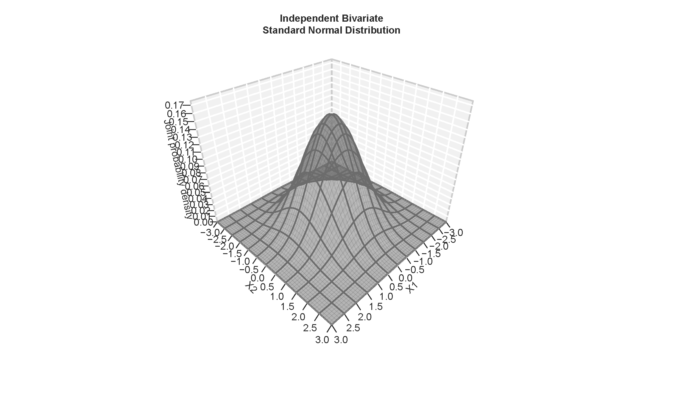

```{r setup, include=FALSE}
knitr::opts_chunk$set(echo = FALSE)

## ---- CRAN Packages ----
## Save package names as a vector of strings
pkgs <-  c("dplyr", "MASS", "ggplot2", "ggpubr")

## Install uninstalled packages
lapply(pkgs[!(pkgs %in% installed.packages())],
       install.packages,
       repos='http://cran.us.r-project.org')

## Load all packages to library and adjust options
lapply(pkgs, library, character.only = TRUE)
```


## Selective R refresher

### Preface: Base R vs tidyverse

- Base R: 
    - collection of native commands
    - historical legacies: not necessarily a "clean" language/syntax
- `tidyverse`:
    - an "opinionated collection of R packages" for data visualization, transformation, tidying, and import
    - more or less uniform syntax
    - Packages: `dplyr`, `ggplot2`, `tibble`, `readr`, `tidyr`, `purrr`, and many others
- both are valid
- both are fully compatible with one another
- both are fully compatible with external packages
- you can do amazing things by relying on one, on the other, or on both
- we will use whichever best suits our purposes (but, mostly, specialized packages like `brms`, `modelsummary` and `marginaleffects`)

### Some important base R

- En route to using `brms`, we will explore some manual implementations of *Markov Chain Monte Carlo* (MCMC) samplers
- The produce *numeric samples* from the posterior distributions of (a) parameter(s)
    - for a single parameter, these are stored in a *vector* of length $S$ ($S$ posterior samples, one parameter)
    - for $K$ parameters, these are stored in a *matrix* of dimensions $S \times K$ ($S$ posterior samples in rows, $K$ parameters in columns)
    
    
### Numeric vectors

A vector is a serial listing of data elements of the same type (e.g. `integer`, `double`, `logical`, or `character`).

### Example

```{r vec1_1, echo = TRUE}
numeric_vector <- c(.99, 1.49, 1.99, 2.79, 1.89)
```

```{r vec1_2, exercise=TRUE, eval=eval_ex}
numeric_vector <- c(.99, 1.49, 1.99, 2.79, 1.89)
```

### Numeric matrices

A matrix is a rectangular arrangement of data elements of the same type.


```{r numeric_matrix_1, echo = TRUE}
numeric_matrix <- matrix(seq(-.35, .35, .1), nrow = 2, ncol = 4)
```

```{r numeric_matrix_2, exercise=TRUE, eval=eval_ex}
numeric_matrix 
```

*Note:* By default, we fill the $8$ elements of the $2 \times 4$ matrix by columns. 
Specify the option `byrow = TRUE` if you want to fill by rows instead.

### Arithmetic operators and common transformations

When working with numeric objects like vectors or matrices, we can apply arithmetic operators and mathematical transformations...

```{r ari, eval=FALSE, echo=TRUE}
x + y     # addition
x - y     # subtraction
x * y     # multiplication
x / y     # division
x ^ y     # exponentiation
x %% y    # modulus
x %/% y   # integer division
log(x)    # natural logarithm
exp(x)    # exponential
sqrt(x)   # square root
t(a)      # vector/matrix transposition
```

### Generic mathematical functions

...as well as generic mathematical functions:

```{r stats, eval=FALSE, echo=TRUE}
mean()      # arithmetic mean()
median()    # median
quantile()  # quantile(s)
sd()        # standard deviation  
var()       # variance
```

### apply

Use `apply()` on matrices or arrays to apply a function across selected dimension(s) of a matrix.

#### Row- and column-means

```{r apply-1, exercise = TRUE}
numeric_matrix
apply(numeric_matrix, 1, mean)
apply(numeric_matrix, 2, mean)
```

#### Custom functions

You can apply custom functions to all apply functions:

```{r apply-2, exercise = TRUE}
count_negative <- function (x) {
  sum(x < 0)
}

apply(numeric_matrix, 1, count_negative)
apply(numeric_matrix, 2, count_negative)
```

## Probability distributions

### Univariate probability distributions

Univariate probability distributions give the distribution of probabilities for all feasible realizations of a single *random variable*.

It characterizes the (cumulative) probability mass of each possible outcome for a *discrete/categorical* variable or the (cumulative) probability density of each value within the support of a *continuous* variable.

### Functions

For common probability distributions, R features the following four commands (where `dist` is a placeholder):

1.  `ddist(x)`: Probability density/mass function (pdf/pmf). Takes a value $x$ and returns the probability density/mass $P(X=x)$.\
2.  `pdist(x)`: Cumulative distribution function (CDF). Takes a value $x$ and returns the cumulative probability $P(X \leq x)$.
3.  `qdist(q)`: Quantile function or inverse CDF. Takes a cumulative probability $P(X \leq x)$ and returns the corresponding value $x$.
4.  `rdist(n)`: Produces $n$ random draws from the distribution.

### Discrete case: The binomial distribution

A binomial distribution characterizes the probability of outcomes for a series of `n` independent realization of a binary random variable.

Numerically, we define a binary variable as a variable that can either take on a value of zero ("failure") or one ("success").

An example is a series of coin flips $n$, each of which produces either heads or tails. The numerical assignment of ones and zeroes is arbitrary. Here, we will consider heads as ones or successes. We denote the number as heads/successes as $k$.

The binomial distribution is governed by a single *probability parameter*, $\pi \in [0,1]$. It determines the probability of successes/ones for each realization. Accordingly, $1 - \pi$ gives the probability of failure/zeroes.

In our example, $\pi$ determines the fairness of a coin. A fair coin with $\pi = 0.5$ is equally likely to produce heads and tails for each flip.

### Probability mass function (pmf)

Below, we show the probability mass function of a random variable $X$ that records the probability of each count of heads $k \in \{0, 1, 2, 3, 4\}$ out of $n=4$ flips with a fair coin, i.e., $\pi = 0.5$: $k \sim \text{Binom}(4, 0.5)$.

```{r binom-1, fig.align = "center", include = TRUE}
n <- 4L
x <- 0:n
pmf <- dbinom(x = x,
              size = n,
              prob = 0.5)
plot(
  x,
  pmf,
  type = 'p',
  pch = 19,
  xlab = "k",
  ylab = "P(X=k)",
  main = "Binomial(4, 0.5)",
  ylim = c(0, max(pmf)),
  xlim = range(x) + c(-.5, .5)
)
for (i in seq_along(x)) {
  segments(x0 = x[i],
           y0 = 0,
           x1 = x[i],
           y1 = pmf[i])
}
```

What do these probabilities sum to?

### Cumulative distribution function (CDF)

```{r binom-2, fig.align = "center", include = TRUE, fig.height=8, fig.width=7}
n <- 4L
x <- 0:n
pmf <- dbinom(x = x,
              size = n,
              prob = 0.5)
cdf <- pbinom(q = x,
              size = n,
              prob = 0.5)

# Initialize plot
par(mfrow = c(2, 1))

## pmf
plot(
  x,
  pmf,
  type = 'p',
  pch = 19,
  xlab = "k",
  ylab = "P(X=k)",
  main = "Binomial(4, 0.5) pmf",
  ylim = c(0, max(pmf)),
  xlim = range(x) + c(-.5, .5)
)
for (i in seq_along(x)) {
  segments(x0 = x[i],
           y0 = 0,
           x1 = x[i],
           y1 = pmf[i])
}

## CDF
plot(
  x,
  cdf,
  type = 'p',
  pch = 19,
  xlab = "k",
  ylab = expression("P(X"<="k)"),
  main = "Binomial(4, 0.5) CDF",
  ylim = c(0, 1),
  xlim = range(x) + c(-.5, .5)
)
for (i in seq_along(x)) {
  segments(x0 = x[i],
           y0 = 0,
           x1 = x[i],
           y1 = cdf[i])
}
```

### Continuous case: The standard normal distribution

Let's illustrate the continuous case using everyone's favorite, the standard normal.

The normal distribution is characterized by two parameters: Mean $\mu$ and *standard deviation* $\sigma$.

The standard normal distribution is a special case where $\mu = 0$ and $\sigma = 1$, $\text{N} \sim (0, 1)$:

```{r stdnorm-1, fig.align = "center", include = TRUE}
x <- seq(-3, 3, .01)
y <- dnorm(x)
plot(
  x,
  y,
  type = 'l',
  xlab = "x",
  ylab = "P(X=x)",
  main = "Standard normal pdf"
)
polygon(
  c(x, rev(x)),
  c(rep(0, length(y)), rev(y)),
  col = adjustcolor("gray50", alpha.f = 0.25),
  border = NA
)
```

### pdf

To get the probability density at any value $x$, e.g., $x = -1$, run:

```{r stdnorm-2, exercise = TRUE, echo = TRUE}
dnorm(-1, mean = 0, sd = 1)
```

```{r stdnorm-3, fig.align = "center", include = TRUE}
x <- seq(-3, 3, .01)
y <- dnorm(x)
x_star <- -1
y_star <- dnorm(x_star)
plot(
  x,
  y,
  type = 'l',
  xlab = "x",
  ylab = "P(X=x)",
  main = "Standard normal pdf"
)
polygon(
  c(x, rev(x)),
  c(rep(0, length(y)), rev(y)),
  col = adjustcolor("gray50", alpha.f = 0.25),
  border = NA
)
segments(x_star, -3.5, x_star, y_star, lty = 3)
segments(-3.5, y_star, x_star, y_star, lty = 3)
```

### CDF and quantile function

To get the cumulative probability up to any value $x$, e.g., $x = 1.9599$, run:

```{r stdnorm-4, exercise = TRUE, echo = TRUE}
pnorm(1.9599, mean = 0, sd = 1)
```

```{r stdnorm-5, fig.align = "center", include = TRUE, fig.height = 8, fig.width=7}
x <- seq(-3, 3, .01)
y <- dnorm(x)
cdf <- pnorm(x)
x_star <- qnorm(.975)

# Initialize plot
par(mfrow = c(2, 1))

# pdf
plot(
  x,
  y,
  type = 'l',
  xlab = "x",
  ylab = "P(X=x)",
  main = "Standard normal pdf"
)
polygon(
  c(x[x <= x_star], rev(x[x <= x_star])),
  c(rep(0, length(y[x <= x_star])), rev(y[x <= x_star])),
  col = adjustcolor("gray50", alpha.f = 0.25),
  border = NA
)

# CDF
plot(
  x,
  cdf,
  type = 'l',
  xlab = "x",
  ylab = expression("P(X"<="x)"),
  main = "Standard normal CDF",
  ylim = c(0, 1)
)
segments(
  x0 = -3.5,
  x1 = x_star,
  y0 = .975,
  y1 = .975,
  lty = 3
)
segments(
  x0 = x_star,
  x1 = x_star,
  y0 = 0,
  y1 = .975,
  lty = 3
)
```

Conversely, use `qnorm` to get the $x$ values for any desired cumulative probability:

```{r stdnorm-6, exercise = TRUE, echo = TRUE}
qnorm(c(.025, .5, .975))
```

```{r stdnorm-7, fig.align = "center", include = TRUE}
x <- seq(-3, 3, .01)
y <- dnorm(x)
x_star <- qnorm(c(.025, .5, .975))
y_star <- dnorm(x_star)

par(mfrow = c(1, 1))
plot(
  x,
  y,
  type = 'l',
  xlab = "x",
  ylab = "P(X=x)",
  main = "Standard normal pdf"
)
for (i in rev(seq_along(x_star))) {
  polygon(
    c(x[x <= x_star[i]], rev(x[x <= x_star[i]])),
    c(rep(0, length(y[x <= x_star[i]])), rev(y[x <= x_star[i]])),
    col = adjustcolor("gray50", alpha.f = 0.35),
    border = NA
  )
}
```

### Random number generation

Lastly, to generate random draws from a distribution with specific parameters, use `rnorm()`. The higher the number of draws, the better the chances that the frequency distribution of your random draws will approximate the underlying pdf:

```{r stdnorm-8, exercise = TRUE, echo = TRUE, fig.align='center'}
# Define number of draws
n_sim <- 1000000L

# Set a seed for replicability
set.seed(20231122L)

# Take random draws
x_sim <- rnorm(n_sim, mean = 0, sd = 1)

# Visualize
hist(
  x_sim,
  main = paste0("Simulated Standard Normal pdf, N = ", n_sim),
  xlab = "x",
  ylab = "Pr(X=x)",
  freq = FALSE,
  breaks = log(n_sim) * 3,
  border = "gray60"
)
```

*Note:* `set.seed()` ensures the replicability of random number generation (!).

### Multivariate probability distributions

Bivariate probability distributions give the distribution of probabilities for all feasible *joint* realizations of *two* random variables.

Multivariate probability distributions generalize this idea to *three or more* random variables.

Multivariate probability distributions carry the same information for the constitutive variables as univariate probability distributions. We call these variable-specific distributions *marginal probability distributions*.

Additionally, multivariate probability distributions carry information about the *mutual dependence* of the constitutive variables. This is typically captured by *covariance parameters*. Independent random variables share a covariance of zero.

### Example: The bivariate standard normal distribution (independent case)

The following shows the joint probability density function of a two standard normal distributions.

We can think of it as a bell-shaped hill with a circular base whose height reaches its peak at $X1 = 0$ and $X2 = 0$.

```{r bvnnorm-1, fig.align = "left", include = TRUE, fig.width=11.67, fig.height=6.67, eval=TRUE, echo=FALSE}
x_axis <- regplane3D::pretty_axis_inputs(
  axis_range = c(-3, 3),
  base = 1,
  nlines_suggest = 21L,
  multiply = 5
)
y_axis <- regplane3D::pretty_axis_inputs(
  axis_range = c(-3, 3),
  base = 1,
  nlines_suggest = 21L,
  multiply = 5
)
z <- dnorm(x_axis$seq) %*% t(dnorm(y_axis$seq)) %>%
  replicate(3L, .) %>%
  simplify2array()

# regplane3D::plane3D(
#   z = z,
#   x = x_axis$seq,
#   y = y_axis$seq,
#   zlim = c(0, 0.175),
#   xlim = x_axis$range,
#   ylim = y_axis$range,
#   zlab = "Joint probability density",
#   xlab = "X1",
#   ylab = "X2",
#   main = "Independent Bivariate\nStandard Normal Distribution",
#   cis = TRUE,
#   xnlines = x_axis$nlines,
#   ynlines = y_axis$nlines,
#   expand = 0.8,
#   theta = 135,
#   phi = 33
# )
```

```{r bvnnorm-1-print, fig.align = "left"}

```

### Heatmaps

Heatmaps are a great way of visualizing joint densities in 2D.

They take a bird's eye perspective and re-express the third dimension (height) through the intensity of color shadings.

They allow us to add information on the marginal distributions, too.

```{r bvnnorm-2, fig.align = "center", include = TRUE, fig.width=7, fig.height=7}
heatmap_data <- expand.grid(
  x = x_axis$seq,
  y = y_axis$seq
) %>%
  dplyr::mutate(
    z = dnorm(x) * dnorm(y)
  )

# x1/x2 marginals
marginal_x1 <- marginal_x2 <- ggplot(data = data.frame(x = c(-100, 100)), aes(x)) +
  stat_function(fun = dnorm,
                n = 10001,
                args = list(mean = 0, sd = 1),
                geom = "polygon",
                color = "black",
                fill = "red",
                alpha = 0.25) +
  ylab("") +
  xlab("") +
  scale_y_continuous(breaks = NULL)  +
  xlim(-3, 3) +
  theme(
    axis.text.x = element_blank(),
    axis.text.y = element_blank(),
    axis.title.x = element_blank(),
    axis.title.y = element_blank()
  ) +
  theme(plot.margin = unit(c(0, 0, 0, 0), 'lines'))

# Joint density
joint_density <- heatmap_data %>%
  ggplot(aes(x = x, y = y)) +
  geom_raster(aes(fill = z)) +
  scale_fill_viridis_c() +
  scale_x_continuous(expand = c(0, 0)) +
  scale_y_continuous(expand = c(0, 0)) +
  xlab("X1") +
  ylab("X2") +
  theme(legend.position = "none") +
  xlim(-3, 3) +
  ylim(-3, 3) +
  theme(plot.margin = unit(c(0, 0, 1, 1), 'lines'))

## Multiplot
ggarrange(
  marginal_x1,
  NULL,
  joint_density,
  marginal_x2 +
    rotate(),
  nrow = 2,
  ncol = 2,
  align = "hv",
  widths = c(2, 1),
  heights = c(1, 2)
)
```

### Example: The bivariate normal distribution (interdependent case)

```{r bvnnorm-3, fig.align = "center", include = TRUE, fig.width=7, fig.height=7}
# BVN pdf
dbvnnorm <- function(x, y, mu_x, sd_x, mu_y, sd_y, rho) {
  return(
    (1 / (2 * pi * sd_x * sd_y * sqrt(1 - rho ^ 2))) *
      exp(-(
        (1 / (2 * (1 - rho ^ 2))) * (
          ((x - mu_x) / sd_x) ^ 2 +
            ((y - mu_y) / sd_y) ^ 2 -
            2 * rho * (
              (x - mu_x) * (y - mu_y) / (sd_x * sd_y)
            )
        )
      ))
  )
}

# Define parameters
mu_x = 0
sd_x = 1
mu_y = -5
sd_y = 2.5
rho = -0.5

# Data
heatmap_data <- expand.grid(x = seq(-3, 3, length.out = 101L) * sd_x + mu_x,
                            y = seq(-3, 3, length.out = 101L) * sd_y + mu_y) %>%
  dplyr::mutate(z = dbvnnorm(
    x,
    y,
    mu_x,
    sd_x,
    mu_y,
    sd_y,
    rho
  ))

# x1/x2 marginals
marginal_x1 <- ggplot(data = data.frame(x = c(-100, 100)), aes(x)) +
  stat_function(fun = dnorm,
                n = 10001,
                args = list(mean = mu_x, sd = sd_x),
                geom = "polygon",
                color = "black",
                fill = "red",
                alpha = 0.25) +
  ylab("") +
  xlab("") +
  scale_y_continuous(breaks = NULL)  +
  xlim(range(heatmap_data$x)) +
  theme(
    axis.text.x = element_blank(),
    axis.text.y = element_blank(),
    axis.title.x = element_blank(),
    axis.title.y = element_blank()
  ) +
  theme(plot.margin = unit(c(0, 0, 0, 0), 'lines'))

marginal_x2 <- ggplot(data = data.frame(x = c(-100, 100)), aes(x)) +
  stat_function(fun = dnorm,
                n = 10001,
                args = list(mean = mu_y, sd = sd_y),
                geom = "polygon",
                color = "black",
                fill = "red",
                alpha = 0.25) +
  ylab("") +
  xlab("") +
  scale_y_continuous(breaks = NULL)  +
  xlim(range(heatmap_data$y)) +
  theme(
    axis.text.x = element_blank(),
    axis.text.y = element_blank(),
    axis.title.x = element_blank(),
    axis.title.y = element_blank()
  ) +
  theme(plot.margin = unit(c(0, 0, 0, 0), 'lines'))

# Joint density
joint_density <- heatmap_data %>%
  ggplot(aes(x = x, y = y)) +
  geom_raster(aes(fill = z)) +
  scale_fill_viridis_c() +
  scale_x_continuous(expand = c(0, 0)) +
  scale_y_continuous(expand = c(0, 0)) +
  xlab("X1") +
  ylab("X2") +
  theme(legend.position = "none") +
  xlim(range(heatmap_data$x)) +
  ylim(range(heatmap_data$y)) +
  theme(plot.margin = unit(c(0, 0, 1, 1), 'lines'))

## Multiplot
ggarrange(
  marginal_x1,
  NULL,
  joint_density,
  marginal_x2 +
    rotate(),
  nrow = 2,
  ncol = 2,
  align = "hv",
  widths = c(2, 1),
  heights = c(1, 2)
)
```

Can you guess:

-   The approximate means and standard deviations of $X_1$ and $X_2$?
-   Whether the correlation between X1 and X2 is positive or negative?

## Frequentist inference

### Ask Wikipedia?

The first two sentences of the [English-language Wikipedia article](https://en.wikipedia.org/wiki/Statistical_inference) defines statistical inference as follows:

<blockquote>
1.  Statistical inference is the process of using data analysis to infer properties of an underlying distribution of probability.
2.  Inferential statistical analysis **infers properties of a population**, for example by testing hypotheses and deriving estimates.
</blockquote>

The first sentence is universally true across both frequentist and Bayesian frameworks of statistical inference.

However, as we will learn in this course, the bold-printed is exclusive to the *frequentist* framework of statistical inference.

### Key characteristics

- Frequentist analysis seeks to infer *population parameters*. Such parameters -- e.g., the population mean of a variable $X$ -- are considered *fixed*: Their values are true, exact, and unknown.
- To learn about such population parameters, we rely on a finite sample. Every such sample is considered one out of many possible random samples from the underlying population.
- This implies *repeatable data*: In theory, we should have a constant stream or pool of independently and identically distributed data, from which we could sample as often as we like.
- Every random sample is an imperfect representation of the underlying population due to *sampling variability*.
- Imagine we took many independent samples from the same underlying population, and computed the sample analogue of the population parameter for each of them -- using a suitable estimator/statistic, the resulting distribution of sample statistics would yield a probability distribution known as the *sampling distribution*.

### Repeated sampling: A though experiment

- Consider an infinite population.
- We want to infer the population proportion of a binary variable $X$ -- say, the number of café-goers who order beverages with oat milk.
- For this task, we will simulate $S=10,000$ samples of size $N = 50$.
- Unbeknownst to us, the true population proportion is $\pi = 0.3$.
- Given that $X$ is binary, we treat each sample as a series of independent Bernoulli trials -- i.e., a draw from a $\text{Binomial}(50, 0.3)$ distribution, where the probability parameter is equal to the population proportion of $X$.

Let us first look at the variability in the number of oat-milk drinkers in our samples:

```{r sim-data, fig.align = "center", include = TRUE, fig.width=7, fig.height=7}
n_samples <- 10000L
n_obs <- 50L
set.seed(20231121L)
samples <- rbinom(n_samples, n_obs, prob = 0.3)

par(mfrow = c(1, 1))
plot(
  x = sort(samples),
  y = seq_along(samples),
  type = "p",
  pch = 19,
  cex = 0.1,
  xlim = c(0, 50),
  xlab = "Number of oat-milk drinkers per sample",
  ylab = "Samples (sorted)"
)
abline(v = mean(samples),
       col = adjustcolor("red", 0.5))
```

As we can see, there is quite some variability: While many (precisely, `r sum(samples %in% 10:20)`) of our 10,000 samples produce between 10 and 20 oat-milk drinkers (with a mean of roughly `r round(mean(samples), 2)`), the numbers go as low as `r min(samples)` and as high as `r max(samples)`.

This is indicative of the significant sampling variability we face when working with small samples.

### A simulated sampling distribution

We can re-express the raw sample counts by calculating the *sample proportion* within each sample. This is also known as an *estimator* or *statistic* -- a function that takes data as inputs to produce an aggregate output. The specific value this function produces is called an *estimate*.

Instead of plotting the number of the index of the sorted samples along the x-axis, we will now plot the **number of simulations** that produce a specific estimate.

```{r sampling-dist, fig.align = "center", include = TRUE, fig.width=7, fig.height=7}
sample_proportions <- table(samples / n_obs)

par(mfrow = c(1, 1))
plot(
  x = as.numeric(names(sample_proportions)),
  y = as.numeric(sample_proportions),
  type = "l",
  xlab = "Sample proportions of oat-milk drinkers",
  ylab = "Number of simulations"
)
abline(v = mean(samples) / n_obs,
       col = adjustcolor("red", 0.5))
```

The above is the **sampling distribution of the estimator** -- in this case, the sampling distribution of the sample proportion for a sample of size 50 from the same underlying population.

### Sampling distributions

You will recognize this distribution as *approximately normal*. This is due to the **central limit theorem**: With sufficiently large samples, the probability distribution of the sample mean (analogously, the sample proportion) across many such samples converges to a normal distribution.

Some facts about sampling distributions:

- Its mean is the true population mean.
- Its standard deviation gives the **standard error** of the estimator.
- Its 2.5 and 97.5 percentiles give the **95% confidence interval**. Since the sampling distribution is normal, the 95% confidence interval can be derived as $\text{mean} \pm 1.96 \times \text{std. err.}$.
- The true sampling distribution of an estimator is **never known**. It can only be approximated by actually taking many, many independent samples.

### The sampling distribution in practice

So, if the *true* sampling distribution is never known, and cannot be recovered from a single sample, what do we do?

We take the sample statistics of a singular sample at face value:

- Take the sample proportion as the best available estimate of the true population proportion: $\hat{p} = \frac{1}{N}\sum_{i=1}^{N} X_i$
- Take the standard error of the sample proportion as the best available estimate of the standard error of the estimator: $\hat{\sigma}_p = \sqrt{\frac{\hat{p} (1- \hat{p})}{N}}$
- Derive the 95% confidence interval accordingly (remember to use the correct $t$-value in place of the $z$-score!)

### Example

```{r sample-stats-1, include=FALSE}
p <- samples[1] / n_obs
se <- sqrt(((samples[1] / n_obs) * (1 - samples[1] / n_obs)) / n_obs)
ci <- p + qt(c(0.025, .975), df = n_obs - 1) * se
```

The first of our 10,000 samples produces the following number of oat-milk drinkers: `r samples[1]`:

- The sample proportion is `r round(p, 3)`.
- The standard error of the sample proportion is `r round(se, 3)`.
- The corresponding 95% confidence interval is `r paste(round(ci, 3), collapse = ", ")`.
- It `r ifelse(prod(ci - 0.3) > 0, "does not", "does")` contain the true population parameter.

What if we had ended up with our second sample instead?

```{r sample-stats-2, include=FALSE}
p <- samples[2] / n_obs
se <- sqrt(((samples[2] / n_obs) * (1 - samples[1] / n_obs)) / n_obs)
ci <- p + qt(c(0.025, .975), df = n_obs - 1) * se
```

- The number of oat-milk drinkers is `r samples[2]`:
- The sample proportion is `r round(p, 3)`.
- The standard error of the sample proportion is `r round(se, 3)`.
- The corresponding 95% confidence interval is `r paste(round(ci, 3), collapse = ", ")`.
- It `r ifelse(prod(ci - 0.3) > 0, "does not", "does")` contain the true population parameter.

### The correct interpretation of a 95% confidence interval

As we have just learned, whether a 95% confidence interval estimated from a given sample covers the true population parameter depends how (un)lucky we are with our sample.

A given 95% confidence interval does **not** contain the true parameter with 95% probability or "certainty". It either does or it doesn't, so the probability is either zero or one.

A 95% confidence interval [*"represents the long-run proportion of CIs (at the given confidence level) that theoretically contain the true value of the parameter"*](https://en.wikipedia.org/wiki/Confidence_interval).

We can see this by looking back at our 10,000 samples:

```{r sim-cis, fig.align = "center", include = TRUE, fig.width=7, fig.height=7}
p <- sort(samples / n_obs)
se <- sqrt((p * (1 - p) / n_obs))
ci_lo <- p + qt(.025, df = n_obs - 1) * se
ci_hi <- p + qt(.975, df = n_obs - 1) * se
contains_true <- ci_lo <= 0.3 & ci_hi >= 0.3

par(mfrow = c(1, 1))
plot(
  x = p,
  y = seq_along(p),
  type = "p",
  pch = 19,
  cex = 0.1,
  xlab = "Proportion of oat-milk drinkers per sample",
  ylab = "Samples (sorted)",
  xlim = c(0, 0.75)
)
abline(v = 0.3,
       col = "black")
segments(
  x0 = ci_lo,
  x1 = ci_hi,
  y0 = seq_along(p),
  y1 = seq_along(p),
  lwd = 0.001,
  col = adjustcolor(ifelse(contains_true, "black", "red"), alpha.f = .1)
)
points(
  x = p,
  y = seq_along(p),
  pch = 19,
  cex = .1,
  col = "white"
)
```

The proportion of 95% CIs that do contain the true mean is `r mean(contains_true)`.

### $p$-values and the logic of frequentist hypothesis testing

Similarly, $p$-values do *not* give the probability of support for an (alternative) hypothesis.

They give probability of finding other results at least as extreme as the present result, given a null hypothesis, as the long-run frequency across many samples.

Example: Let our hypothesis be that the proportion of oat-milk drinkers in the population is 0.5.

Remember our first sample had `r samples[1]` oat milk drinkers, a proportion of `r p[1]`.

To test our hypothesis based on this sample data, we first need a t-score:

```{r t-score, echo = TRUE}
t <- (p[1] - 0.5) / se[1]
t
```

We can the calculate the $p$-value for a two-tailed test as

```{r p-val, echo = TRUE}
2 * pt(-abs(t), df = n_obs - 1)
```

This value is near zero. This shows that we would expect that hardly any other sample would produce a result as extreme as ours if the null hypothesis were true. We would therefore *reject* the null hypothesis.

<!-- ## Take-aways and outlook -->

<!-- 1. R: Most social science data comes in rectangular form -- as do posterior draws for multiple parameters -->
<!--     1. `for` loops present an intuitive (albeit not necessarily computationally efficient) way for performing (conditional) iterative operations across rows/and or columns -->
<!--     1. `apply` is a handy tool for summarizing information across rows/and or columns -->
<!-- 1. Probability distributions -->
<!--     1. Although probability distributions have different meanings in frequentist and Bayesian inference, they are central to understanding inferential uncertainty in both paradigms. -->
<!--     1. Probability distribution also describe generative models that link parameters to outcomes: They stipulate data-generating processes that explain how we can think of the realization of values of different types of variables -->
<!-- 1. Frequentist inference seeks to infer properties of an underlying population -->
<!--     1. It relies on the (theoretical) possibility of repeated sampling from a quasi-infinite stream or pool of independently and identically distributed data -->
<!--     1. The sampling distribution, confidence intervals, and $p$-values characterize long-run frequencies of an estimator -->
